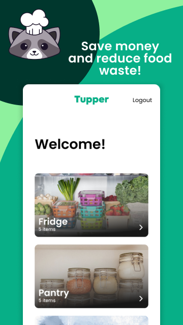
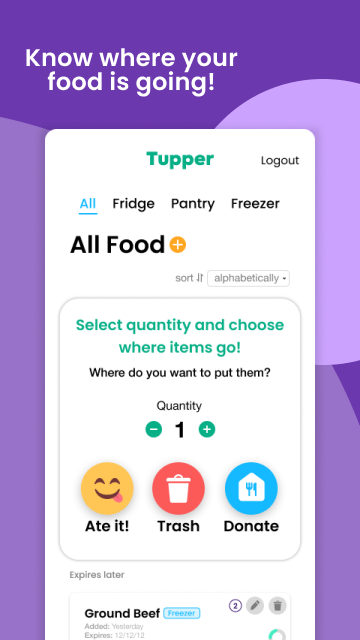
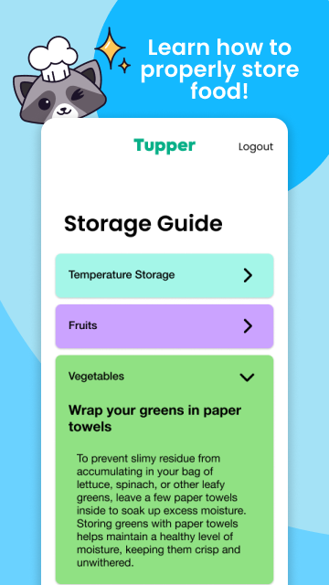

# Tupper - Food Storage Tracker!

## Track expiry dates & combat food waste!

- Tupper’s goal is to empower you to throw away less food, save money and help the environment.
- It is estimated that up to 30-40% of the food supply in the United States is wasted and nearly 1/2 of all fruit and vegetables produced globally are wasted each year1. That, in turn, is a waste of energy, water, labor, and money resources. Especially during this global recession, you can save money simply by buying only what you need, eating what you buy, and avoiding throwing away food.

- Tupper is a mobile application that empowers you to quickly inventory and manage your food, track and be alerted to items that are going bad, and encourages you to use or donate your food items instead of just throwing them away.

## Built With

- React Native
- Typescript
- Redux Toolkit
- React query
- Firebase

## Features

- Responsive design that works on both Android and iOS phones.
- Authentication
- Add food item
- Edit food item
- Check storage food items
- Sort food item alphabetically or by expiry date
- Food storage tips
- Push notification

## Download

## Tupper Team

👤 **Christina Knoll - Product Manager**

- LinkedIn: [Christina Knoll](https://www.linkedin.com/in/christina-knoll-83442969/)

👤 **Paolo Suarez - Designer**

- LinkedIn: [Paolo Suarez](https://www.linkedin.com/in/pmsuarez/)

👤 **Ahmet Bozacı - Developer**

- LinkedIn: [Ahmet Bozaci](https://www.linkedin.com/in/ahmetbozaci/)
- Github: [ahmtbozaci](https://github.com/ahmetbozaci)
- Twitter: [ahmtbozaci](https://twitter.com/ahmtbozaci)

👤 **Lawal Dauda - Developer**

- LinkedIn: [Lawal Dauda](https://www.linkedin.com/in/omodauda/)
- Github: [omodauda](https://github.com/omodauda)

Give a ⭐️ if you like this project!
